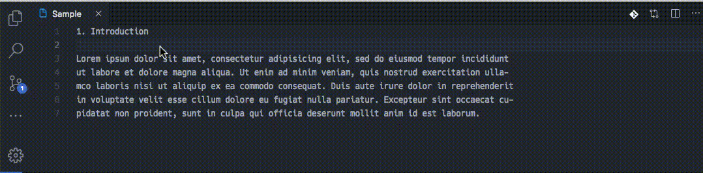

# engshaper

An extension that shapes English for Google Translate.

## Features

- Remove line breaks unrelated to the sentence
- Line breaks at the sentence level (abbreviations are retained)
- Remove hyphenation

## Usage

Run `Shape English for Google Translate` from command palette.

## Known Issues

TBC

## Release Notes

### 0.0.1

Initial release
